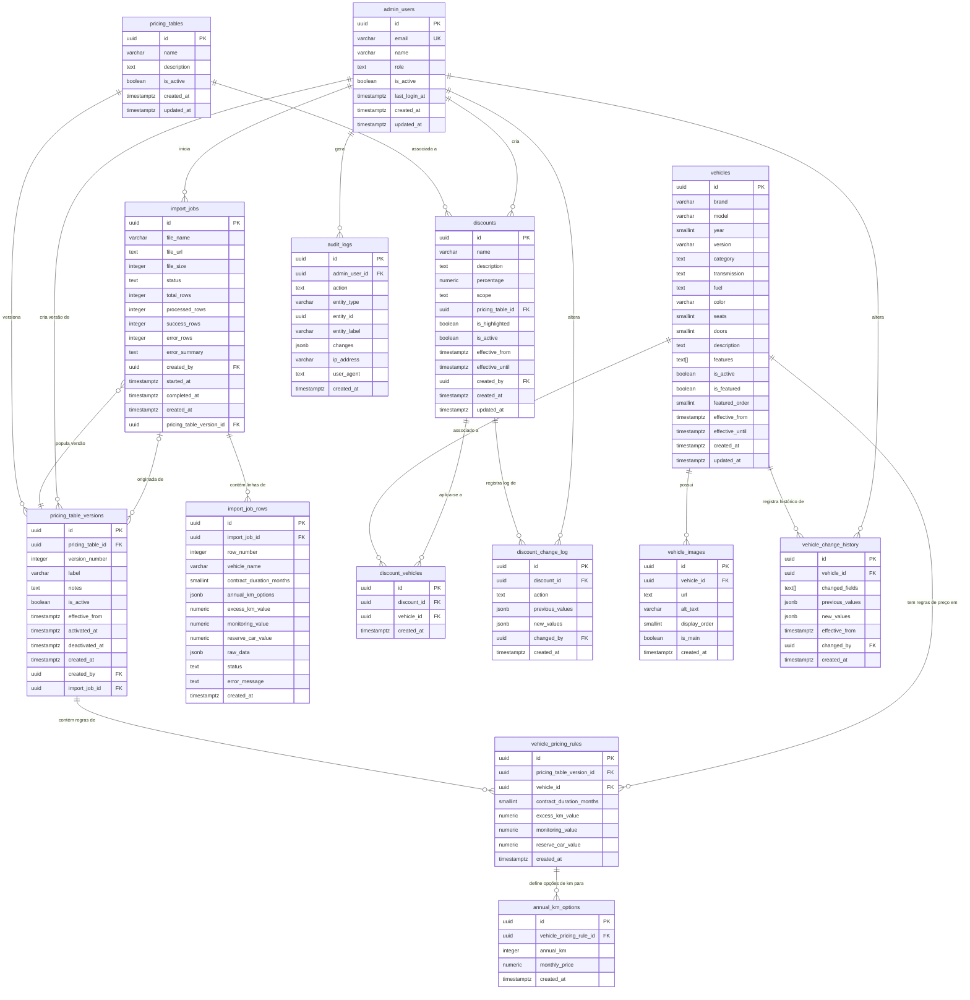

# Diagrama do Modelo de Banco de Dados — DrivioGo

**DrivioGo — seu carro por assinatura**
**Versão:** 1.0.0
**Data:** 2026-03-20

---

## Modelo Entidade-Relacionamento

---

## Legenda de Tipos

| Tipo | Descrição |
|------|-----------|
| `PK` | Chave primária |
| `FK` | Chave estrangeira |
| `UK` | Unique constraint |
| `uuid` | Identificador único universal |
| `varchar` | Texto de comprimento variável |
| `text` | Texto longo |
| `text[]` | Array de texto |
| `jsonb` | JSON binário (PostgreSQL) |
| `boolean` | Verdadeiro / Falso |
| `integer` / `smallint` | Inteiro |
| `numeric` | Número decimal de precisão |
| `timestamptz` | Timestamp com fuso horário |

---

## Grupos Funcionais

| Grupo | Tabelas |
|-------|---------|
| **Identidade / Auth** | `admin_users` |
| **Catálogo de Veículos** | `vehicles`, `vehicle_images`, `vehicle_change_history` |
| **Precificação** | `pricing_tables`, `pricing_table_versions`, `vehicle_pricing_rules`, `annual_km_options` |
| **Importação** | `import_jobs`, `import_job_rows` |
| **Descontos** | `discounts`, `discount_vehicles`, `discount_change_log` |
| **Auditoria** | `audit_logs` |

---

## Enums e Valores Permitidos

### `admin_users.role`
`SUPER_ADMIN` | `ADMIN` | `VIEWER`

### `vehicles.category`
`HATCH` | `SEDAN` | `SUV` | `PICKUP` | `MINIVAN` | `ESPORTIVO` | `ELETRICO`

### `vehicles.transmission`
`MANUAL` | `AUTOMATICO` | `CVT`

### `vehicles.fuel`
`FLEX` | `GASOLINA` | `DIESEL` | `ELETRICO` | `HIBRIDO`

### `discounts.scope`
`ALL` | `TABLE` | `VEHICLE`

### `import_jobs.status`
`PENDING` | `PROCESSING` | `SUCCESS` | `FAILED` | `CANCELLED`

### `import_job_rows.status`
`PENDING` | `SUCCESS` | `ERROR` | `SKIPPED`

### `audit_logs.action`
`CREATE` | `UPDATE` | `DELETE` | `ACTIVATE` | `DEACTIVATE` | `IMPORT` | `LOGIN` | `LOGOUT` | `PASSWORD_CHANGE`

### `discount_change_log.action`
`CREATE` | `UPDATE` | `DEACTIVATE` | `REACTIVATE`
